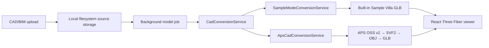

# Spericorn Homes — Villa 3D POC

A deliberately small technical POC for validating the upload, job, GLB delivery, and browser-viewer workflow now, while retaining a real CAD/BIM-to-browser APS path for later.



It intentionally excludes authentication, CRM, pricing, configuration, AR, and every other future sales-platform feature.

## Local 2D DWG → 3D pipeline (`CAD_CONVERSION_PROVIDER=local`)

The client's primary input is now **2D architectural DWG**. A third conversion provider reconstructs a basic 3D villa from 2D linework,
entirely on this machine, and adds a 2D review step and a minimal furniture configurator:

```
Upload DWG → ODA File Converter → DXF → ezdxf → rule-based detection (walls · rooms · doors · windows)
           → 2D review screen (what the parser understood, overrides) → Generate 3D → trimesh → GLB
           → Three.js viewer → select room → place / drag / rotate furniture → save / reload configuration
```

* APS and Sample providers are unchanged and selected the same way (`CAD_CONVERSION_PROVIDER=aps|sample`).
* Geometry lives in the Python worker: [cad-worker/README.md](cad-worker/README.md) (Python + ODA File Converter setup, CLI, adding rules).
* Coordinate contract – plan `(x, y)` ⇒ scene `(x, 0, −y)`, metres, floor at `Y = 0`: [docs/COORDINATES.md](docs/COORDINATES.md).
* Results on a real DWG, limitations, APS comparison and production options: [docs/LOCAL_PIPELINE_REPORT.md](docs/LOCAL_PIPELINE_REPORT.md).
* If no walls can be detected the job **fails with diagnostics** (layers, entity counts, candidates). It never substitutes a sample model.

Quick start:

```bash
npm install
cd cad-worker && python3 -m venv .venv && .venv/bin/pip install -r requirements.txt && .venv/bin/python -m cadworker doctor && cd ..
cp .env.example .env        # CAD_CONVERSION_PROVIDER=local; set ODA_FILE_CONVERTER_PATH if not auto-detected
npm run dev
```

Additional API (local provider): `GET /api/models/:id/analysis`, `POST /api/models/:id/analyze` (re-run with overrides),
`POST /api/models/:id/generate`, `GET|PUT /api/models/:id/configuration`. Extra statuses: `converting_dwg`, `parsing_dxf`,
`detecting_geometry`, `awaiting_review`, `generating_3d`, `exporting_glb`.

Tests: `npm test` (backend 26 incl. a real API → Python → GLB integration test, frontend 19) and `cd cad-worker && .venv/bin/python -m pytest` (43).

## What this POC proves

- The browser can select or drag-and-drop a configured CAD/BIM extension, validate its size, and upload it with progress.
- The Node API safely stores the source under a generated model ID, creates a non-blocking conversion record, and exposes status polling.
- In **Sample Mode**, upload, background-job status, secured GLB delivery, and the complete browser viewer can be validated without APS credentials or a CAD conversion provider.
- In **APS Mode**, the converter uses OAuth v2, OSS v2 signed-S3 uploads, SVF2 translation, OBJ geometry extraction, secure derivative download, and local OBJ-to-GLB conversion.
- A GLB can be loaded by React Three Fiber and inspected with orbit, pan, zoom, reset, fit, and fullscreen controls.
- The viewer calculates a bounding box, recentres models far from the origin, and frames very large or small models.
- The UI reports source/output size, server conversion time, browser load time, and an approximate live FPS.

## What this POC does not prove

- Furniture replacement, room editing, pricing, quotations, AR, offline operation, customer accounts, or production scale.
- That every DWG, IFC, RVT, STEP, or STP variant has a successful APS translation. Source version, references, authoring software, and model quality still matter.
- Original BIM/CAD object hierarchy in the resulting GLB. APS retains viewer metadata/hierarchy in SVF2, but the generic OBJ-to-GLB derivative is geometry-oriented. The POC reports this explicitly instead of faking a tree.
- A successful live APS conversion in this checkout: no APS credentials or real villa source file were supplied. Sample Mode deliberately does **not** prove CAD conversion, model hierarchy preservation, source dimensions, or 2D-vs-3D classification.

## Repository layout

```text
frontend/                         Next.js + React Three Fiber application
  app/                             upload and viewer pages
  components/                      uploader, polling progress, viewer, info panel
  lib/                             typed API client and file validation
backend/                           Express API
  src/services/conversion/         provider selection/composition root
  src/services/model/              job metadata and lifecycle
  src/services/storage/            local filesystem abstraction
  src/infrastructure/aps/          isolated real APS conversion adapter
  src/infrastructure/sample/       embedded Sample Villa GLB adapter
  src/controllers/, routes/        HTTP-only concerns
  test/                            validation, persistence, and OBJ → GLB tests
.env.example                       backend environment template
```

## Prerequisites

- Node.js 20.20+ and npm 11+
- No APS account or CAD source is required for Sample Mode.
- APS Mode additionally requires an Autodesk Platform Services application and an actual **3D** villa CAD/BIM file (not a 2D plan).

The API keys are server-only. Never prefix them with `NEXT_PUBLIC_` or put them in frontend files.

## Setup

1. Copy `.env.example` to `.env` in the repository root.
2. Leave `CAD_CONVERSION_PROVIDER=sample` to run without APS credentials.
3. Install and start both apps:

   ```bash
   npm install
   npm run dev
   ```

4. Open `http://localhost:3000`.

The backend runs on `http://localhost:4000`. To point a separately deployed frontend at it, copy `frontend/.env.example` to `frontend/.env.local` and change `NEXT_PUBLIC_API_BASE_URL`.

### Sample Mode — default, no APS credentials

```dotenv
CAD_CONVERSION_PROVIDER=sample
```

Upload any configured source extension. The server stores that upload and completes a normal model job, but `SampleModeConversionService` writes the built-in **Sample Villa GLB** instead of reading or converting the upload. The upload, progress, viewer, camera controls, browser GLB loading, and performance panel can therefore be developed without APS access.

The upload page, progress screen, viewer header, information panel, and model record all explicitly identify this mode. It is only for frontend/3D-viewer validation and must never be presented as successful CAD conversion.

### APS Mode — real CAD/BIM conversion

Set all of the following in the root `.env`, then restart the backend:

```dotenv
CAD_CONVERSION_PROVIDER=aps
APS_CLIENT_ID=your_aps_client_id
APS_CLIENT_SECRET=your_aps_client_secret
APS_BUCKET_KEY=your-globally-unique-lowercase-bucket-key
APS_REGION=US
```

`APS_BUCKET_KEY` may be omitted in development; the backend derives one from the client ID. `APS_POLL_INTERVAL_MS` is optional. When APS Mode is selected without both credentials, `/api/config` reports a clear configuration error and the upload action is disabled. APS secrets stay in the backend environment and never appear in frontend code or API responses.

## Environment variables

| Variable | Required | Purpose |
| --- | --- | --- |
| `PORT` | no | Backend port; defaults to `4000`. |
| `UPLOAD_DIR` | no | Local, private source-file root. |
| `OUTPUT_DIR` | no | Local, private generated-GLB root. |
| `MAX_UPLOAD_SIZE_MB` | no | Multipart upload limit; defaults to `100`. |
| `SUPPORTED_SOURCE_FORMATS` | no | Comma-separated extension allowlist; defaults to `dwg,ifc,rvt,step,stp`. |
| `CAD_CONVERSION_PROVIDER` | no | `sample` (default) or `aps`. |
| `APS_CLIENT_ID` / `APS_CLIENT_SECRET` | APS only | Required server-side APS credentials when provider is `aps`. |
| `APS_BUCKET_KEY` | APS only | Globally unique OSS transient bucket key; optional only when using the derived development key. |
| `APS_REGION` | APS only | `US` or `EMEA`; defaults to `US`. |
| `APS_POLL_INTERVAL_MS` | APS only | APS manifest polling delay; defaults to `3000`. |

## API

| Method | Route | Result |
| --- | --- | --- |
| `GET` | `/health` | Basic API liveness response. |
| `GET` | `/api/config` | Source extensions, upload limit, active converter, Sample Mode flag, and any APS configuration error. |
| `POST` | `/api/models/upload` | `multipart/form-data` field `file`; returns `{ modelId, status: "uploaded" }`. |
| `POST` | `/api/models/:id/convert` | Queues work and immediately returns `{ modelId, status: "queued" }`. |
| `GET` | `/api/models/:id/status` | Returns `status`, `progress`, `stage`, and a safe failure message. |
| `GET` | `/api/models/:id` | Model metadata and, when ready, its guarded GLB URL. |
| `GET` | `/api/models/:id/model.glb` | Generated GLB only; no arbitrary filesystem path is exposed. |
| `DELETE` | `/api/models/:id` | Deletes the model source, derivative, and metadata record. |

Status values are `uploaded`, `queued`, `processing`, `converting`, `post_processing`, `completed`, and `failed`.

## CAD conversion details

The rest of the application depends only on `CadConversionService`. Provider selection occurs once in `createCadConversionService`; controllers, `ModelService`, storage, polling, and the viewer do not branch on APS details.

### Sample converter

`SampleModeConversionService` performs no network calls and never invokes APS. It emits ordinary job-progress updates and writes a predefined, built-in 1.3 KB Sample Villa GLB to the generated model directory. The original upload is retained only to validate the upload/storage flow. Because it does not inspect the source, it cannot distinguish 2D drawings, derive source dimensions, or preserve source hierarchy.

### APS converter

APS does **not** provide a one-size-fits-all direct CAD-to-GLB Model Derivative result. The implemented path is deliberately explicit:

1. Obtain a server-only APS OAuth 2-legged access token through `/authentication/v2/token`.
2. Store the uploaded source in an APS OSS v2 transient bucket via a signed S3 upload URL.
3. Request an SVF2 3D translation and poll its manifest.
4. Confirm that the manifest contains a successful 3D geometry view. If it completes without one, fail with the user-facing 2D-CAD message — no geometry is fabricated.
5. Retrieve the successful 3D view's `modelGuid` from the APS Model Views (`/metadata`) response, then use it with APS's documented `objectIds: [-1]` all-elements sentinel. Manifest GUIDs are not used for geometry extraction.
6. Request an APS OBJ geometry extraction, download its signed derivative, and run `obj2gltf` locally to create the delivered `.glb`.

The current APS references used to verify the implementation are the [APS Model Derivative overview](https://aps.autodesk.com/developer/overview/model-derivative-api), [current simple-viewer translation walkthrough](https://get-started.aps.autodesk.com/tutorials/simple-viewer/data/), [OSS v2 signed-upload migration guidance](https://aps.autodesk.com/blog/object-storage-service-oss-api-deprecating-v1-endpoints), [OAuth v2 migration guide](https://aps.autodesk.com/blog/migration-guide-oauth2-v1-v2), and [APS guidance on the required `modelGuid` and `objectIds` for geometry extraction](https://aps.autodesk.com/blog/translate-files-obj).

### Supported formats and 2D validation

The default configured input candidates are `.dwg`, `.ifc`, `.rvt`, `.step`, and `.stp`; change one environment variable to change the allowlist. The browser and server validate extension and upload size before storage. A filename extension is not proof of usable 3D content, so final 2D-vs-3D classification happens only after APS returns the translated manifest. A 2D DWG is rejected rather than displayed as a misleading empty/flat 3D villa.

For models with linked Revit assets, this minimal POC does not package host and links into a ZIP with `rootFilename`; that is a recommended next enhancement.

## Viewer behavior

The viewer uses `useGLTF`, a Three.js bounding box, and `OrbitControls`. It centres the loaded scene before rendering and computes a camera distance from its dimensions and field of view. This makes the fit behavior independent of a source model's origin and scale. It includes neutral lighting, a ground grid, loading and error states, a concise metadata panel, and guarded fullscreen support.

## Security notes

- Only configured extensions are accepted; the request size has a server-side Multer limit.
- Original filenames are never used as filesystem paths. Storage uses a UUID model directory and a sanitized leaf name.
- The model source stays private; only a completed record's exact GLB is served.
- APS secrets and access tokens never travel to the browser or API responses.
- API errors are user-facing rather than stack traces.
- Rejected multipart files are removed from the incoming directory.

This is still a POC: add malware scanning, content-signature checks, quotas, retention policies, authentication/authorization, CORS deployment rules, and a managed object store before production.

## Test and verification results

Run locally:

```bash
npm run typecheck
npm test
npm run build
```

This implementation passed TypeScript checks, all fifteen unit tests, and a production Next.js build. Covered tests include extension/path sanitization, model-record persistence and status changes, backend model creation/status and failed-conversion lifecycle behavior, Sample Mode factory selection and no-network GLB delivery, browser-side upload rendering and invalid-extension/size checks, server-driven conversion progress, viewer loading/error states, and GLB integrity checks. A local Sample Mode smoke test also uploaded a fixture, completed the job, and served the valid 1.3 KB built-in GLB without APS credentials.

Actual APS CAD files tested in this environment: **none** — credentials and a real 3D CAD/BIM source were unavailable. Sample Mode has been exercised by tests that verify the built-in GLB is emitted without a network call; it does not prove APS conversion.

## Live acceptance checklist

With Sample Mode enabled:

1. Start the stack with `CAD_CONVERSION_PROVIDER=sample`, upload any configured extension, and verify the Sample Mode warnings remain visible through the viewer.
2. Confirm the viewer loads the built-in villa; orbit, zoom, pan, Reset camera, Fit model, and Fullscreen should work.

With APS credentials and a real 3D villa file available:

1. Start the stack, open `http://localhost:3000`, and upload the model.
2. Confirm the five progress stages proceed to completion.
3. Confirm `/api/models/:id/status` reaches `completed`, and the record includes a model URL plus source/GLB/conversion metrics.
4. Confirm `/viewer/:id` loads the generated GLB; orbit, scroll zoom, right-drag pan, Reset camera, Fit model, and Fullscreen should all work.
5. Repeat with a known 2D DWG and verify the explicit 2D-data rejection.
6. Repeat with a corrupt/unsupported/oversized file and verify each safe error.

Record the actual source size, GLB size, APS conversion duration, browser load time, and FPS from the UI for the feasibility report; they are model- and network-dependent, so no invented figures are included here.

## Production recommendation

Keep the `CadConversionService`, `FileSystemStorage`, and `ModelRepository` boundaries. Replace local storage with S3/Azure/Supabase, the JSON repository with PostgreSQL, and in-process work with a durable queue only after this workflow is validated. For production-scale BIM metadata and an inspectable object tree, keep APS SVF2 as a first-class derivative and use APS Viewer/metadata APIs beside (not hidden inside) the GLB delivery pipeline. Add retry policies, dead-letter handling, upload scanning, per-user authorization, rate limits, structured observability, signed model URLs, and an explicit CAD compatibility matrix based on real customer files.
